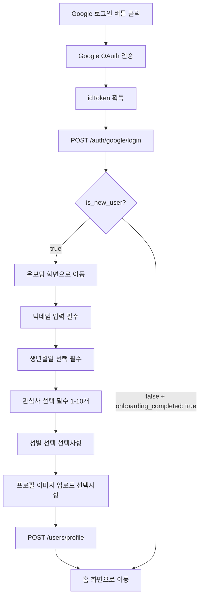

# Tripgether API 명세서

> Flutter ↔ Backend 데이터 통신 규격

---

## 📍 API 목록

| 메서드 | 엔드포인트 | 설명 | 인증 필요 |
|--------|-----------|------|----------|
| POST | `/auth/google/login` | Google 소셜 로그인 | ❌ |
| POST | `/users/profile` | 온보딩 완료 (신규 사용자) | ✅ Bearer Token |

**인증 방식**: JWT Bearer Token (로그인 API 응답으로 받은 `access_token` 사용)

---

## 1️⃣ Google 로그인 API

### `POST /auth/google/login`

Google OAuth 인증 후 백엔드 로그인 처리

### 📤 요청 (Flutter → Backend)

**Headers**
```
Content-Type: application/json
```

**Body**
| 필드 | 타입 | 필수 | 설명 |
|------|------|------|------|
| `idToken` | String | ✅ | Google ID Token (JWT) |

**예시**
```json
{
  "idToken": "eyJhbGciOiJSUzI1NiIsImtpZCI6IjE3ZjBmMGYxNG...구글_토큰_예시"
}
```

### 📥 응답 (Backend → Flutter)

#### ✅ 성공 - 신규 사용자 (200 OK)

```json
{
  "access_token": "backend_jwt_token_example_abc123",
  "token_type": "bearer",
  "expires_in": 86400,
  "is_new_user": true,
  "user": {
    "id": 123,
    "email": "user@example.com",
    "email_verified": true,
    "provider": "google",
    "onboarding_completed": false,
    "created_at": "2025-01-15T10:30:00Z"
  }
}
```

**→ Flutter 동작**: `is_new_user: true` → **온보딩 화면으로 이동**

#### ✅ 성공 - 기존 사용자 (200 OK)

```json
{
  "access_token": "backend_jwt_token_example_abc123",
  "token_type": "bearer",
  "expires_in": 86400,
  "is_new_user": false,
  "user": {
    "id": 123,
    "email": "user@example.com",
    "nickname": "여행러버",
    "birth_date": "1995-03-15",
    "interests": ["자연", "맛집", "사진", "힐링"],
    "gender": "female",
    "profile_image_url": "https://storage.tripgether.com/profiles/123.jpg",
    "email_verified": true,
    "provider": "google",
    "onboarding_completed": true,
    "created_at": "2025-01-10T08:20:00Z",
    "last_login": "2025-01-15T10:30:00Z"
  }
}
```

**→ Flutter 동작**: `is_new_user: false` AND `onboarding_completed: true` → **홈 화면으로 이동**

#### ❌ 실패 응답

**401 Unauthorized** - ID Token 검증 실패
```json
{
  "error": "invalid_token",
  "message": "ID Token 검증 실패: 토큰이 만료되었습니다"
}
```

**500 Internal Server Error** - 서버 오류
```json
{
  "error": "server_error",
  "message": "사용자 생성 중 오류가 발생했습니다"
}
```

### 💻 Flutter 코드 예제

```dart
Future<bool> loginWithGoogle() async {
  // 1. Google 로그인
  final googleUser = await GoogleAuthService.signIn();
  if (googleUser == null) return false;

  final googleAuth = await googleUser.authentication;

  // 2. 백엔드 API 호출
  try {
    final response = await dio.post(
      '/auth/google/login',
      data: {
        'idToken': googleAuth.idToken,  // ✅ idToken만 전송
      },
    );

    // 3. JWT 토큰 저장
    final accessToken = response.data['access_token'];
    await secureStorage.write(key: 'access_token', value: accessToken);

    // 4. 신규/기존 사용자 분기
    if (response.data['is_new_user'] == true) {
      // 신규 사용자 → 온보딩 화면
      context.go(AppRoutes.onboarding);
    } else {
      // 기존 사용자 → 홈 화면
      context.go(AppRoutes.home);
    }

    return true;
  } catch (e) {
    debugPrint('로그인 실패: $e');
    return false;
  }
}
```

---

## 2️⃣ 온보딩 완료 API

### `POST /users/profile`

신규 사용자의 온보딩 정보 입력 완료

### 📤 요청 (Flutter → Backend)

**Headers**
```
Content-Type: application/json
Authorization: Bearer {access_token}
```

**Body**
| 필드 | 타입 | 필수 | 설명 |
|------|------|------|------|
| `nickname` | String | ✅ | 닉네임 (2-20자, 한글/영문/숫자) |
| `birth_date` | String | ✅ | 생년월일 (YYYY-MM-DD 형식) |
| `interests` | Array\<String\> | ✅ | 관심사 목록 (1-10개) |
| `gender` | String | ❌ | 성별 ("male", "female", "other", null) |
| `profile_image_url` | String | ❌ | 프로필 이미지 URL |

**허용된 관심사 목록**
```
["자연", "맛집", "사진", "힐링", "액티비티", "쇼핑", "문화", "역사", "예술", "축제"]
```

**예시**
```json
{
  "nickname": "여행러버",
  "birth_date": "1995-03-15",
  "interests": ["자연", "맛집", "사진", "힐링"],
  "gender": "female",
  "profile_image_url": "https://storage.tripgether.com/profiles/123.jpg"
}
```

### 📥 응답 (Backend → Flutter)

#### ✅ 성공 (200 OK)

```json
{
  "success": true,
  "user": {
    "id": 123,
    "email": "user@example.com",
    "nickname": "여행러버",
    "birth_date": "1995-03-15",
    "interests": ["자연", "맛집", "사진", "힐링"],
    "gender": "female",
    "profile_image_url": "https://storage.tripgether.com/profiles/123.jpg",
    "email_verified": true,
    "provider": "google",
    "onboarding_completed": true
  }
}
```

**→ Flutter 동작**: 온보딩 완료 → **홈 화면으로 이동**

#### ❌ 실패 응답

**400 Bad Request** - 닉네임 중복
```json
{
  "error": "validation_error",
  "message": "이미 사용 중인 닉네임입니다"
}
```

**400 Bad Request** - 생년월일 검증 실패
```json
{
  "error": "validation_error",
  "message": "만 14세 이상만 가입 가능합니다"
}
```

**400 Bad Request** - 관심사 검증 실패
```json
{
  "error": "validation_error",
  "message": "최소 1개 이상의 관심사를 선택해주세요"
}
```

**401 Unauthorized** - 토큰 인증 실패
```json
{
  "error": "invalid_token",
  "message": "로그인이 필요합니다"
}
```

### 💻 Flutter 코드 예제

```dart
Future<void> submitOnboarding({
  required String nickname,
  required DateTime birthDate,
  required List<String> interests,
  String? gender,
  String? profileImageUrl,
}) async {
  // 1. 저장된 JWT 토큰 가져오기
  final token = await secureStorage.read(key: 'access_token');
  if (token == null) throw Exception('로그인 토큰이 없습니다');

  // 2. 온보딩 API 호출
  try {
    final response = await dio.post(
      '/users/profile',
      data: {
        'nickname': nickname,
        'birth_date': DateFormat('yyyy-MM-dd').format(birthDate),
        'interests': interests,
        if (gender != null) 'gender': gender,  // 선택사항
        if (profileImageUrl != null) 'profile_image_url': profileImageUrl,  // 선택사항
      },
      options: Options(
        headers: {'Authorization': 'Bearer $token'},
      ),
    );

    // 3. 온보딩 완료 → 홈으로 이동
    if (response.statusCode == 200 && context.mounted) {
      context.go(AppRoutes.home);
    }
  } on DioException catch (e) {
    // 4. 에러 처리
    if (e.response?.data != null && e.response!.data['message'] != null) {
      throw Exception(e.response!.data['message']);
    }
    throw Exception('네트워크 오류: ${e.message}');
  }
}
```

---

## 📦 데이터 타입 정의

### User 객체

| 필드 | 타입 | 설명 | 신규 사용자 | 기존 사용자 |
|------|------|------|------------|------------|
| `id` | Integer | 사용자 고유 ID | ✅ | ✅ |
| `email` | String | 이메일 주소 | ✅ | ✅ |
| `nickname` | String | 닉네임 | ❌ null | ✅ |
| `birth_date` | String | 생년월일 (YYYY-MM-DD) | ❌ null | ✅ |
| `interests` | Array\<String\> | 관심사 목록 | ❌ null | ✅ |
| `gender` | String | 성별 (null 가능) | ❌ null | ⚠️ null 가능 |
| `profile_image_url` | String | 프로필 이미지 URL | ❌ null | ⚠️ null 가능 |
| `email_verified` | Boolean | 이메일 인증 여부 | ✅ | ✅ |
| `provider` | String | 로그인 제공자 ("google", "apple", "email") | ✅ | ✅ |
| `onboarding_completed` | Boolean | 온보딩 완료 여부 | ✅ false | ✅ true |
| `created_at` | String | 계정 생성 시간 (ISO 8601) | ✅ | ✅ |
| `last_login` | String | 마지막 로그인 시간 (ISO 8601) | ❌ | ✅ |

### Error 객체

| 필드 | 타입 | 설명 |
|------|------|------|
| `error` | String | 에러 코드 |
| `message` | String | 사람이 읽을 수 있는 에러 메시지 |

**에러 코드 목록**
| 에러 코드 | HTTP Status | 설명 |
|-----------|-------------|------|
| `invalid_token` | 401 | ID Token 또는 JWT 토큰 검증 실패 |
| `validation_error` | 400 | 요청 데이터 검증 실패 (닉네임 중복, 필수 필드 누락 등) |
| `server_error` | 500 | 서버 내부 오류 |

---

## 🔄 온보딩 플로우



---

## 🔐 보안 주의사항

### ✅ Flutter에서 해야 할 것

1. **ID Token만 전송**
   - Google에서 받은 `idToken`만 백엔드로 전송
   - `email`, `displayName`, `photoUrl` 등은 백엔드가 토큰 검증으로 추출

2. **JWT 토큰 안전하게 저장**
   ```dart
   // ✅ 올바른 방법
   await secureStorage.write(key: 'access_token', value: token);

   // ❌ 잘못된 방법
   SharedPreferences.setString('token', token);  // 평문 저장 위험
   ```

3. **토큰 만료 처리**
   - `expires_in: 86400` (24시간)
   - 만료 시 재로그인 또는 Refresh Token 사용

### ✅ Backend에서 해야 할 것

1. **ID Token 반드시 검증**
   - Google 공개 키로 JWT 서명 검증
   - 클라이언트가 보낸 다른 데이터(email 등)는 신뢰하지 말 것

2. **닉네임 중복 체크**
   - DB `nickname` 컬럼에 UNIQUE 제약 조건

3. **생년월일 검증**
   - 만 14세 이상만 허용
   - 미래 날짜 거부

4. **관심사 검증**
   - 허용된 목록에서만 선택 가능
   - 1-10개 범위 체크

---

## 📝 체크리스트

### Flutter 개발자

- [ ] Google Sign-In 패키지 설정 완료
- [ ] `idToken` 추출 및 API 호출 구현
- [ ] JWT 토큰 FlutterSecureStorage에 저장
- [ ] `is_new_user` 분기 처리 (온보딩/홈)
- [ ] 온보딩 화면 구현 (닉네임, 생년월일, 관심사, 성별)
- [ ] 에러 처리 (401, 400, 500)
- [ ] 네트워크 오류 처리

### Backend 개발자

- [ ] Google ID Token 검증 로직 구현
- [ ] User DB 모델 생성 (필드: nickname, birth_date, interests, gender, onboarding_completed)
- [ ] POST /auth/google/login 엔드포인트 구현
- [ ] POST /users/profile 엔드포인트 구현
- [ ] JWT 토큰 발급 로직
- [ ] 닉네임 중복 검증
- [ ] 생년월일 검증 (만 14세 이상)
- [ ] 관심사 검증 (허용 목록, 1-10개)
- [ ] 에러 응답 표준화

---

## ❓ FAQ

**Q1. `idToken`은 어디서 오나요?**
A. Google Sign-In 패키지의 `GoogleSignInAuthentication` 객체에서 `googleAuth.idToken`으로 획득합니다.

**Q2. 성별을 선택 안 하면 어떻게 되나요?**
A. `gender: null`로 전송되며, 백엔드는 이를 허용합니다. 나중에 프로필 수정으로 입력 가능합니다.

**Q3. 온보딩 중간에 앱을 종료하면?**
A. 다음 로그인 시 `onboarding_completed: false`이므로 다시 온보딩 화면으로 이동합니다.

**Q4. 관심사를 나중에 변경할 수 있나요?**
A. 이 API 명세에는 없지만, 추후 `PATCH /users/profile` API를 추가하면 가능합니다.

**Q5. 백엔드에서 interests를 어떻게 저장하나요?**
A. 방법 1: JSON 배열 (PostgreSQL JSONB)
   방법 2: 쉼표로 구분된 문자열 ("자연,맛집,사진")
   방법 3: 별도 UserInterest 테이블 (정규화)

---

**문서 버전**: 1.0
**마지막 업데이트**: 2025-01-15
**담당자**: Flutter/Backend 공동 작업
