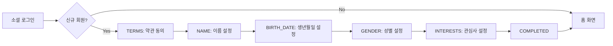

# Backend API 문서

> **📚 Tripgether : 여행의 동반자 📚**
> 자동 생성: 2025-11-15
> 소스: https://api.tripgether.suhsaechan.kr/swagger-ui/index.html

## 📡 서버 환경

| 환경 | URL | 용도 |
|------|-----|------|
| **메인 서버** | `https://api.tripgether.suhsaechan.kr` | 프로덕션 환경 |
| **테스트 서버** | `https://api.test.tripgether.suhsaechan.kr` | 테스트/스테이징 |
| **로컬 서버** | `http://localhost:8080` | 로컬 개발 |

## 🔐 인증 방식

### Bearer Token (JWT)
- **Header**: `Authorization: Bearer {accessToken}`
- **Access Token 유효기간**: 1시간
- **Refresh Token 유효기간**: 7일

### 인증 플로우
```dart
// 1. 소셜 로그인 (Google/Kakao)
POST /api/auth/sign-in
→ { accessToken, refreshToken, isFirstLogin }

// 2. 토큰 재발급
POST /api/auth/reissue
→ { accessToken, refreshToken }

// 3. 로그아웃
POST /api/auth/logout (Header: Authorization)
→ 200 OK
```

---

## 📑 API 엔드포인트

### 1️⃣ 인증 API (Authentication)

#### 1-1. 소셜 로그인
```
POST /api/auth/sign-in
```

**인증 필요**: ❌ 없음

**Request Body** (`AuthRequest`):
```json
{
  "socialPlatform": "GOOGLE",  // KAKAO | GOOGLE
  "email": "user@example.com",
  "name": "홍길동",
  "profileUrl": "https://example.com/profile.jpg"  // 선택
}
```

**Response** (`AuthResponse`):
```json
{
  "accessToken": "eyJhbGciOiJIUzI1NiIs...",
  "refreshToken": "eyJhbGciOiJIUzI1NiIs...",
  "isFirstLogin": true,
  "requiresOnboarding": true,
  "onboardingStep": "TERMS"  // TERMS | NAME | BIRTH_DATE | GENDER | INTERESTS | COMPLETED
}
```

**에러 코드**:
- `INVALID_SOCIAL_TOKEN`: 유효하지 않은 소셜 인증 토큰
- `SOCIAL_AUTH_FAILED`: 소셜 로그인 인증 실패
- `MEMBER_NOT_FOUND`: 회원 정보를 찾을 수 없음

---

#### 1-2. 토큰 재발급
```
POST /api/auth/reissue
```

**인증 필요**: ❌ 없음

**Request Body**:
```json
{
  "refreshToken": "eyJhbGciOiJIUzI1NiIs..."
}
```

**Response** (`AuthResponse`):
```json
{
  "accessToken": "NEW_ACCESS_TOKEN",
  "refreshToken": "SAME_REFRESH_TOKEN",
  "isFirstLogin": false
}
```

**에러 코드**:
- `REFRESH_TOKEN_NOT_FOUND`: 리프레시 토큰을 찾을 수 없음
- `INVALID_REFRESH_TOKEN`: 유효하지 않은 리프레시 토큰
- `EXPIRED_REFRESH_TOKEN`: 만료된 리프레시 토큰

---

#### 1-3. 로그아웃
```
POST /api/auth/logout
Header: Authorization: Bearer {accessToken}
```

**인증 필요**: ✅ JWT

**Request Body**:
```json
{
  "refreshToken": "eyJhbGciOiJIUzI1NiIs..."
}
```

**Response**: `200 OK` (빈 응답)

**동작**:
- Access Token을 블랙리스트에 등록 (무효화)
- Redis에서 Refresh Token 삭제

---

### 2️⃣ 회원 관리 API (Member)

#### 2-1. 온보딩: 약관 동의
```
POST /api/members/onboarding/terms
```

**인증 필요**: ✅ JWT

**Request Body** (`UpdateServiceAgreementTermsRequest`):
```json
{
  "isServiceTermsAndPrivacyAgreed": true,  // 필수
  "isMarketingAgreed": false  // 선택
}
```

**Response** (`UpdateServiceAgreementTermsResponse`):
```json
{
  "currentStep": "NAME",  // 다음 단계
  "onboardingStatus": "IN_PROGRESS",
  "member": { /* MemberDto */ }
}
```

**에러 코드**:
- `MEMBER_TERMS_REQUIRED_NOT_AGREED`: 필수 약관 미동의

---

#### 2-2. 온보딩: 이름 설정
```
POST /api/members/onboarding/name
```

**인증 필요**: ✅ JWT

**Request Body** (`UpdateNameRequest`):
```json
{
  "name": "홍길동"  // 2-50자
}
```

**Response** (`OnboardingResponse`):
```json
{
  "currentStep": "BIRTH_DATE",
  "onboardingStatus": "IN_PROGRESS",
  "member": { /* MemberDto */ }
}
```

---

#### 2-3. 온보딩: 생년월일 설정
```
POST /api/members/onboarding/birth-date
```

**인증 필요**: ✅ JWT

**Request Body** (`UpdateBirthDateRequest`):
```json
{
  "birthDate": "1990-01-01"  // LocalDate 형식
}
```

**Response**: `OnboardingResponse`

---

#### 2-4. 온보딩: 성별 설정
```
POST /api/members/onboarding/gender
```

**인증 필요**: ✅ JWT

**Request Body** (`UpdateGenderRequest`):
```json
{
  "gender": "MALE"  // MALE | FEMALE
}
```

**Response**: `OnboardingResponse`

---

#### 2-5. 온보딩: 관심사 설정
```
POST /api/members/onboarding/interests
```

**인증 필요**: ✅ JWT

**Request Body** (`UpdateInterestsRequest`):
```json
{
  "interestIds": [
    "550e8400-e29b-41d4-a716-446655440000",
    "660e8400-e29b-41d4-a716-446655440001"
  ]
}
```

**Response**: `OnboardingResponse`

**특이사항**:
- 최소 1개 이상 필수
- 기존 관심사는 전체 삭제 후 새로 추가 (전체 교체)

**에러 코드**:
- `INTEREST_NOT_FOUND`: 유효하지 않은 관심사 ID

---

#### 2-6. 회원 프로필 설정(수정)
```
POST /api/members/profile
```

**인증 필요**: ✅ JWT

**Request Body** (`ProfileUpdateRequest`):
```json
{
  "name": "새이름",
  "gender": "MALE",
  "birthDate": "1990-01-01",
  "interestIds": [
    "550e8400-e29b-41d4-a716-446655440000"
  ]
}
```

**Response**: `MemberDto`

**특이사항**:
- 이름 중복 검사 수행
- 관심사도 함께 업데이트

**에러 코드**:
- `NAME_ALREADY_EXISTS`: 이미 사용 중인 이름

---

#### 2-7. 회원 단건 조회 (ID)
```
GET /api/members/{memberId}
```

**인증 필요**: ❌ 없음

**Path Parameter**:
- `memberId`: UUID 형식

**Response** (`MemberDto`):
```json
{
  "id": "550e8400-e29b-41d4-a716-446655440000",
  "email": "user@example.com",
  "name": "여행러버",
  "onboardingStatus": "COMPLETED",
  "isServiceTermsAndPrivacyAgreed": true,
  "isMarketingAgreed": false,
  "birthDate": "1990-01-01",
  "gender": "MALE"
}
```

---

#### 2-8. 회원 단건 조회 (Email)
```
GET /api/members/email/{email}
```

**인증 필요**: ❌ 없음

**Path Parameter**:
- `email`: 이메일 주소

**Response**: `MemberDto`

---

#### 2-9. 회원 관심사 조회 (ID)
```
GET /api/members/{memberId}/interests
```

**인증 필요**: ❌ 없음

**Response** (`List<InterestDto>`):
```json
[
  {
    "id": "550e8400-e29b-41d4-a716-446655440000",
    "name": "한식"
  },
  {
    "id": "660e8400-e29b-41d4-a716-446655440001",
    "name": "카페"
  }
]
```

---

#### 2-10. 전체 회원 목록 조회
```
GET /api/members
```

**인증 필요**: ❌ 없음

**Response**: `List<MemberDto>`

**특이사항**:
- 삭제되지 않은 회원만 조회

---

#### 2-11. 회원 생성
```
POST /api/members
```

**인증 필요**: ❌ 없음

**Request Body** (`MemberDto`):
```json
{
  "email": "user@example.com",
  "name": "홍길동",
  "profileImageUrl": "https://example.com/profile.jpg",  // 선택
  "socialPlatform": "GOOGLE",  // KAKAO | GOOGLE
  "memberRole": "ROLE_USER",  // ROLE_USER | ROLE_ADMIN
  "status": "ACTIVE"  // ACTIVE | INACTIVE | DELETED
}
```

**Response**: `MemberDto`

**에러 코드**:
- `EMAIL_ALREADY_EXISTS`: 이미 가입된 이메일

---

### 3️⃣ 관심사 관리 API (Interest)

#### 3-1. 전체 관심사 목록 조회
```
GET /api/interests
```

**인증 필요**: ❌ 없음

**Response** (`GetAllInterestsResponse`):
```json
{
  "categories": [
    {
      "category": "FOOD",
      "displayName": "맛집/푸드",
      "interests": [
        {
          "id": "550e8400-e29b-41d4-a716-446655440000",
          "name": "한식"
        },
        {
          "id": "660e8400-e29b-41d4-a716-446655440001",
          "name": "일식"
        }
      ]
    },
    {
      "category": "CAFE_DESSERT",
      "displayName": "카페/디저트",
      "interests": [ /* ... */ ]
    }
  ]
}
```

**특이사항**:
- 13개 대분류 카테고리별로 그룹핑
- Redis 캐싱 적용

**카테고리 종류**:
- `FOOD`: 맛집/푸드
- `CAFE_DESSERT`: 카페/디저트
- `LOCAL_MARKET`: 로컬 마켓
- `NATURE_OUTDOOR`: 자연/아웃도어
- `URBAN_PHOTOSPOTS`: 도심 포토스팟
- `CULTURE_ART`: 문화/예술
- `HISTORY_ARCHITECTURE`: 역사/건축
- `EXPERIENCE_CLASS`: 체험/클래스
- `SHOPPING_FASHION`: 쇼핑/패션
- `NIGHTLIFE`: 나이트라이프
- `WELLNESS`: 웰니스
- `FAMILY_KIDS`: 가족/키즈
- `KPOP_CULTURE`: K-POP/한류
- `DRIVE_SUBURBS`: 드라이브/교외

---

#### 3-2. 관심사 상세 조회
```
GET /api/interests/{interestId}
```

**인증 필요**: ❌ 없음

**Response** (`GetInterestByIdResponse`):
```json
{
  "id": "550e8400-e29b-41d4-a716-446655440000",
  "category": "FOOD",
  "categoryDisplayName": "맛집/푸드",
  "name": "한식"
}
```

---

#### 3-3. 특정 카테고리 관심사 조회
```
GET /api/interests/categories/{category}
```

**인증 필요**: ❌ 없음

**Path Parameter**:
- `category`: 카테고리 코드 (FOOD, CAFE_DESSERT 등)

**Response** (`GetInterestsByCategoryResponse`):
```json
{
  "interests": [
    {
      "id": "550e8400-e29b-41d4-a716-446655440000",
      "name": "한식"
    },
    {
      "id": "660e8400-e29b-41d4-a716-446655440001",
      "name": "일식"
    }
  ]
}
```

---

### 4️⃣ 콘텐츠 API (Content)

#### 4-1. 콘텐츠 생성 후 장소 추출 요청
```
POST /api/content/analyze
```

**인증 필요**: ✅ JWT

**Request Body** (`PlaceExtractionRequest`):
```json
{
  "contentId": "550e8400-e29b-41d4-a716-446655440000",
  "snsUrl": "https://www.instagram.com/p/ABC123/"
}
```

**Response** (`RequestPlaceExtractionResponse`):
```json
{
  "contentId": "550e8400-e29b-41d4-a716-446655440000",
  "status": "PENDING"  // PENDING | ANALYZING | COMPLETED | FAILED | DELETED
}
```

**특이사항**:
- **중요**: 동일 URL로 이미 COMPLETED된 콘텐츠가 있으면 AI 요청 없이 기존 데이터 즉시 반환 (중복 방지 및 비용 절감)
- PENDING/FAILED 상태의 콘텐츠는 재사용하여 AI 서버에 재요청
- AI 서버 처리 완료 시 Webhook을 통해 상태 변경
- URL 최대 길이: 2048자

**에러 코드**:
- `CONTENT_NOT_FOUND`: 콘텐츠를 찾을 수 없음
- `URL_TOO_LONG`: URL이 허용된 최대 길이 초과
- `AI_SERVER_ERROR`: AI 서버 처리 중 오류

---

### 5️⃣ AI 서버 API (AI Server)

#### 5-1. AI 서버 Webhook Callback
```
POST /api/ai/callback
Header: X-API-Key: {API_KEY}
```

**인증 필요**: ✅ API Key (Header: `X-API-Key`)

**Request Body** (`AiCallbackRequest`):
```json
{
  "contentId": "550e8400-e29b-41d4-a716-446655440000",
  "resultStatus": "SUCCESS",  // SUCCESS | FAILED
  "snsPlatform": "INSTAGRAM",  // INSTAGRAM | YOUTUBE_SHORTS
  "contentInfo": {
    "title": "서울 여행 브이로그",
    "contentUrl": "https://instagram.com/v/t51.2885-15/234123",
    "thumbnailUrl": "https://cdn.instagram.com/v/t51.2885-15/...",
    "platformUploader": "travel_lover"
  },
  "places": [
    {
      "name": "명동 교자",
      "address": "서울특별시 중구 명동길 29",
      "country": "KR",  // ISO 3166-1 alpha-2
      "latitude": 37.563512,
      "longitude": 126.985012,
      "description": "칼국수와 만두로 유명한 맛집",
      "rawData": "명동 교자에서 칼국수 먹었어요 (caption, confidence: 0.95)"
    }
  ]
}
```

**Response** (`AiCallbackResponse`):
```json
{
  "received": true,
  "contentId": "550e8400-e29b-41d4-a716-446655440000"
}
```

**특이사항**:
- AI 서버가 장소 추출 분석 완료 후 호출
- Content 상태를 ANALYZING → COMPLETED/FAILED로 변경
- SUCCESS인 경우 Place 생성 및 Content-Place 연결

**에러 코드**:
- `INVALID_API_KEY`: 유효하지 않은 API Key
- `INVALID_REQUEST`: 잘못된 요청

---

## 📊 데이터 모델

### MemberDto
```dart
class MemberDto {
  final String id;                    // UUID
  final String email;
  final String name;                  // 2-50자
  final String onboardingStatus;      // NOT_STARTED | IN_PROGRESS | COMPLETED
  final bool isServiceTermsAndPrivacyAgreed;
  final bool isMarketingAgreed;
  final String? birthDate;            // LocalDate (YYYY-MM-DD)
  final String? gender;               // MALE | FEMALE
}
```

### OnboardingResponse
```dart
class OnboardingResponse {
  final String currentStep;          // TERMS | NAME | BIRTH_DATE | GENDER | INTERESTS | COMPLETED
  final String onboardingStatus;     // NOT_STARTED | IN_PROGRESS | COMPLETED
  final MemberDto member;            // 디버깅용
}
```

### InterestDto
```dart
class InterestDto {
  final String id;                   // UUID
  final String name;
}
```

### CategoryGroup
```dart
class CategoryGroup {
  final String category;             // FOOD, CAFE_DESSERT 등
  final String displayName;          // "맛집/푸드"
  final List<InterestItem> interests;
}
```

---

## 🚨 공통 에러 코드

| 코드 | HTTP Status | 설명 |
|------|-------------|------|
| `MEMBER_NOT_FOUND` | 404 | 회원을 찾을 수 없음 |
| `INVALID_INPUT_VALUE` | 400 | 유효하지 않은 입력값 |
| `UNAUTHORIZED` | 401 | 인증이 필요한 요청 |
| `INVALID_TOKEN` | 401 | 유효하지 않은 토큰 |
| `EXPIRED_TOKEN` | 401 | 만료된 토큰 |
| `INTERNAL_SERVER_ERROR` | 500 | 서버 내부 오류 |

---

## 🔄 온보딩 플로우



**온보딩 단계** (`currentStep`):
1. `TERMS`: 약관 동의
2. `NAME`: 이름 설정
3. `BIRTH_DATE`: 생년월일 설정
4. `GENDER`: 성별 설정
5. `INTERESTS`: 관심사 설정
6. `COMPLETED`: 완료

---

## 💡 Flutter 구현 가이드

### 1. API 클라이언트 설정
```dart
// lib/core/services/api/api_client.dart
import 'package:dio/dio.dart';
import 'package:flutter_secure_storage/flutter_secure_storage.dart';

class ApiClient {
  static const String baseUrl = 'https://api.tripgether.suhsaechan.kr';
  late final Dio _dio;
  final FlutterSecureStorage _storage = const FlutterSecureStorage();

  ApiClient() {
    _dio = Dio(BaseOptions(
      baseUrl: baseUrl,
      connectTimeout: const Duration(seconds: 10),
      receiveTimeout: const Duration(seconds: 10),
      headers: {
        'Content-Type': 'application/json;charset=UTF-8',
      },
    ));

    // 인터셉터: Access Token 자동 추가
    _dio.interceptors.add(InterceptorsWrapper(
      onRequest: (options, handler) async {
        final token = await _storage.read(key: 'accessToken');
        if (token != null) {
          options.headers['Authorization'] = 'Bearer $token';
        }
        return handler.next(options);
      },
      onError: (error, handler) async {
        // 401 에러 시 토큰 재발급 시도
        if (error.response?.statusCode == 401) {
          final refreshToken = await _storage.read(key: 'refreshToken');
          if (refreshToken != null) {
            // 토큰 재발급 로직
            try {
              final response = await _dio.post('/api/auth/reissue', data: {
                'refreshToken': refreshToken,
              });

              final newAccessToken = response.data['accessToken'];
              await _storage.write(key: 'accessToken', value: newAccessToken);

              // 원래 요청 재시도
              error.requestOptions.headers['Authorization'] = 'Bearer $newAccessToken';
              return handler.resolve(await _dio.fetch(error.requestOptions));
            } catch (e) {
              // 재발급 실패 시 로그아웃 처리
              await _storage.deleteAll();
              return handler.reject(error);
            }
          }
        }
        return handler.next(error);
      },
    ));
  }

  Dio get dio => _dio;
}
```

### 2. 인증 서비스
```dart
// lib/core/services/api/auth_service.dart
class AuthService {
  final ApiClient _apiClient;

  AuthService(this._apiClient);

  /// 소셜 로그인
  Future<AuthResponse> signIn({
    required String socialPlatform,
    required String email,
    required String name,
    String? profileUrl,
  }) async {
    final response = await _apiClient.dio.post('/api/auth/sign-in', data: {
      'socialPlatform': socialPlatform,
      'email': email,
      'name': name,
      'profileUrl': profileUrl,
    });

    return AuthResponse.fromJson(response.data);
  }

  /// 토큰 재발급
  Future<AuthResponse> reissue(String refreshToken) async {
    final response = await _apiClient.dio.post('/api/auth/reissue', data: {
      'refreshToken': refreshToken,
    });

    return AuthResponse.fromJson(response.data);
  }

  /// 로그아웃
  Future<void> logout(String refreshToken) async {
    await _apiClient.dio.post('/api/auth/logout', data: {
      'refreshToken': refreshToken,
    });
  }
}
```

### 3. 회원 서비스
```dart
// lib/core/services/api/member_service.dart
class MemberService {
  final ApiClient _apiClient;

  MemberService(this._apiClient);

  /// 약관 동의
  Future<OnboardingResponse> agreeTerms({
    required bool isServiceTermsAndPrivacyAgreed,
    bool isMarketingAgreed = false,
  }) async {
    final response = await _apiClient.dio.post(
      '/api/members/onboarding/terms',
      data: {
        'isServiceTermsAndPrivacyAgreed': isServiceTermsAndPrivacyAgreed,
        'isMarketingAgreed': isMarketingAgreed,
      },
    );

    return OnboardingResponse.fromJson(response.data);
  }

  /// 이름 설정
  Future<OnboardingResponse> updateName(String name) async {
    final response = await _apiClient.dio.post(
      '/api/members/onboarding/name',
      data: {'name': name},
    );

    return OnboardingResponse.fromJson(response.data);
  }

  /// 생년월일 설정
  Future<OnboardingResponse> updateBirthDate(String birthDate) async {
    final response = await _apiClient.dio.post(
      '/api/members/onboarding/birth-date',
      data: {'birthDate': birthDate},
    );

    return OnboardingResponse.fromJson(response.data);
  }

  /// 성별 설정
  Future<OnboardingResponse> updateGender(String gender) async {
    final response = await _apiClient.dio.post(
      '/api/members/onboarding/gender',
      data: {'gender': gender},
    );

    return OnboardingResponse.fromJson(response.data);
  }

  /// 관심사 설정
  Future<OnboardingResponse> updateInterests(List<String> interestIds) async {
    final response = await _apiClient.dio.post(
      '/api/members/onboarding/interests',
      data: {'interestIds': interestIds},
    );

    return OnboardingResponse.fromJson(response.data);
  }

  /// 회원 프로필 수정
  Future<MemberDto> updateProfile({
    required String name,
    String? gender,
    String? birthDate,
    List<String>? interestIds,
  }) async {
    final response = await _apiClient.dio.post(
      '/api/members/profile',
      data: {
        'name': name,
        if (gender != null) 'gender': gender,
        if (birthDate != null) 'birthDate': birthDate,
        if (interestIds != null) 'interestIds': interestIds,
      },
    );

    return MemberDto.fromJson(response.data);
  }
}
```

### 4. 관심사 서비스
```dart
// lib/core/services/api/interest_service.dart
class InterestService {
  final ApiClient _apiClient;

  InterestService(this._apiClient);

  /// 전체 관심사 목록 조회 (카테고리별 그룹핑)
  Future<GetAllInterestsResponse> getAllInterests() async {
    final response = await _apiClient.dio.get('/api/interests');
    return GetAllInterestsResponse.fromJson(response.data);
  }

  /// 관심사 상세 조회
  Future<GetInterestByIdResponse> getInterestById(String interestId) async {
    final response = await _apiClient.dio.get('/api/interests/$interestId');
    return GetInterestByIdResponse.fromJson(response.data);
  }

  /// 특정 카테고리 관심사 조회
  Future<GetInterestsByCategoryResponse> getInterestsByCategory(
    String category,
  ) async {
    final response = await _apiClient.dio.get('/api/interests/categories/$category');
    return GetInterestsByCategoryResponse.fromJson(response.data);
  }
}
```

### 5. 콘텐츠 서비스
```dart
// lib/core/services/api/content_service.dart
class ContentService {
  final ApiClient _apiClient;

  ContentService(this._apiClient);

  /// 콘텐츠 생성 후 장소 추출 요청
  Future<RequestPlaceExtractionResponse> analyzeContent({
    required String contentId,
    required String snsUrl,
  }) async {
    final response = await _apiClient.dio.post(
      '/api/content/analyze',
      data: {
        'contentId': contentId,
        'snsUrl': snsUrl,
      },
    );

    return RequestPlaceExtractionResponse.fromJson(response.data);
  }
}
```

---

## 📝 참고사항

### 1. 에러 처리
```dart
try {
  final response = await authService.signIn(/* ... */);
} on DioException catch (e) {
  if (e.response?.statusCode == 400) {
    // INVALID_INPUT_VALUE
    print('입력값을 확인하세요');
  } else if (e.response?.statusCode == 401) {
    // UNAUTHORIZED
    print('인증이 필요합니다');
  } else if (e.response?.statusCode == 404) {
    // NOT_FOUND
    print('리소스를 찾을 수 없습니다');
  } else {
    // INTERNAL_SERVER_ERROR
    print('서버 오류가 발생했습니다');
  }
}
```

### 2. 온보딩 상태 관리
```dart
// lib/features/onboarding/providers/onboarding_provider.dart
@riverpod
class OnboardingNotifier extends _$OnboardingNotifier {
  @override
  Future<OnboardingState> build() async {
    // 초기 상태 로드
    return OnboardingState.initial();
  }

  Future<void> agreeTerms({
    required bool isServiceTermsAndPrivacyAgreed,
    bool isMarketingAgreed = false,
  }) async {
    state = const AsyncValue.loading();
    state = await AsyncValue.guard(() async {
      final response = await ref.read(memberServiceProvider).agreeTerms(
        isServiceTermsAndPrivacyAgreed: isServiceTermsAndPrivacyAgreed,
        isMarketingAgreed: isMarketingAgreed,
      );

      return OnboardingState(
        currentStep: response.currentStep,
        status: response.onboardingStatus,
      );
    });
  }

  // updateName, updateBirthDate, updateGender, updateInterests 등...
}
```

### 3. 캐싱 전략
- **관심사 목록**: 앱 시작 시 캐싱, 24시간 유지
- **회원 정보**: 로그인 시 캐싱, 프로필 수정 시 갱신
- **토큰**: Flutter Secure Storage에 안전하게 저장

---

## 📞 문의 및 이슈

**API 변경 이력**: 각 엔드포인트 설명의 "API 변경 이력" 테이블 참고
**GitHub Issues**: [Tripgether-BE Repository](https://github.com/TEAM-Tripgether/Tripgether-BE/issues)

---

**문서 버전**: 1.0.0
**마지막 업데이트**: 2025-11-15
**생성 방법**: Playwright MCP를 통한 Swagger JSON 자동 추출 및 분석
